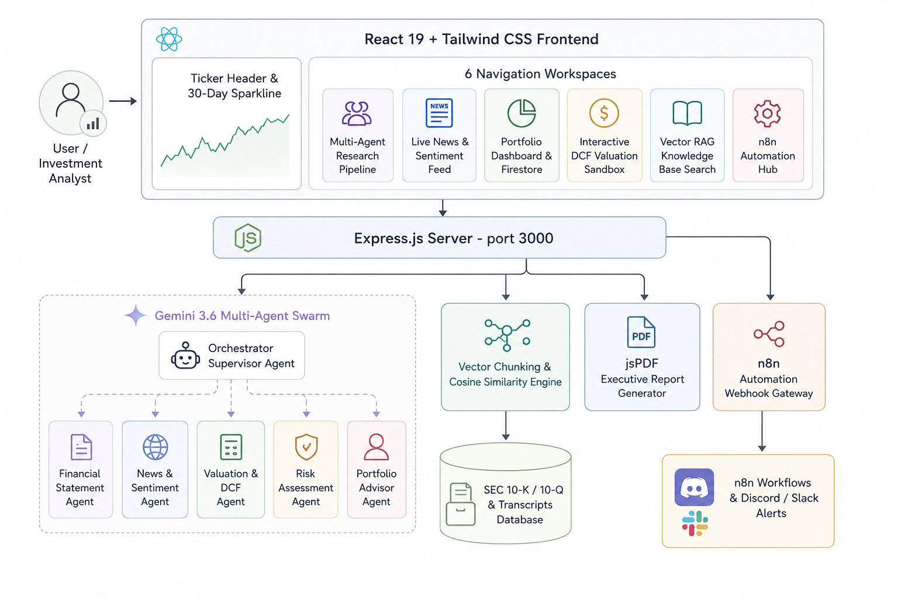

# Meridian — Institutional Multi-Agent AI Investment Research Platform

[](https://github.com/)
[](https://www.typescriptlang.org/)
[](https://react.dev/)
[](https://expressjs.com/)
[](https://platform.openai.com/)
[](https://tailwindcss.com/)
[](LICENSE)

> **Created and Owned Exclusively by Ayan kumar**

**Meridian** is a full-stack, institutional-grade financial research, DCF valuation modeling, real-time market intelligence, and portfolio optimization platform powered by **6 specialized OpenAI SDK AI agents**, a high-performance **Vector RAG Knowledge Base**, interactive **Discounted Cash Flow (DCF) Sandbox**, **Executive PDF Export engine**, and seamless **n8n Automation Webhooks**.

---

## 🏛️ System Architecture



---

## ✨ Core Features & Workspaces

### 🤖 1. Multi-Agent Orchestration Swarm
Coordinated execution across **6 specialized AI agents** that work in parallel to synthesize institutional research:
1. **Financial Statement Analysis Agent**: Evaluates operating leverage, gross margins, EBITDA, working capital efficiency, free cash flow conversion, and debt service safety ratios.
2. **News & Market Sentiment Agent**: Analyzes news feeds, earnings call tone, regulatory announcements, and flags macroeconomic catalysts and risks.
3. **Valuation & DCF Modeling Agent**: Computes WACC, terminal growth rates, multi-stage cash flow projections, and base/bull/bear price targets.
4. **Risk Matrix Evaluation Agent**: Quantifies beta, historical volatility, tail risk, sector risks, and formulates strategic hedging mitigants.
5. **Portfolio Advisor Agent**: Calculates position sizing recommendations, sector concentration limits, and syncs holdings to the portfolio database.
6. **Supervisor Orchestrator Agent**: Aggregates all 5 agent outputs into an executive investment summary with rating (STRONG BUY, BUY, HOLD, SELL), price target, and confidence score.

### 📰 2. Live News & AI Sentiment Feed
- Real-time financial stream covering tech earnings, macroeconomic policy, M&A activity, and SEC announcements.
- Dynamic **AI Sentiment Gauge** showing market sentiment heat ratios (-1.0 to +1.0).
- Instant filtering by category and single-click focus on specific ticker symbols.

### 📊 3. Interactive DCF Valuation Sandbox
- Real-time parameter sliders for Revenue Growth Rate (%), Discount Rate / WACC (%), Terminal Growth Rate (%), and Operating Margin (%).
- Instant recalculation of Enterprise Value, Net Debt, Equity Value, Fair Value per share, and Implied Upside/Downside vs current market price.
- Scenario comparison table across **Base Case**, **Bull Case**, and **Bear Case**.

### 📚 4. Vector RAG Knowledge Base
- Indexing Form 10-K, Form 10-Q, Form 8-K filings, earnings call transcripts, and equity analyst reports.
- Real-time cosine similarity search retrieving exact grounded document chunks with source metadata, page numbers, and similarity metrics.
- Seamless context injection into OpenAI SDK prompts to guarantee zero hallucinations.

### ⚡ 5. n8n Automation Engine & Webhooks
- Out-of-the-box integration with n8n workflow automation.
- Interactive node graph viewer inspecting workflow triggers (Daily SEC Scrapers, Earnings Watchers, Portfolio Digest).
- Instant JSON export for self-hosted or cloud n8n deployment.

### 📄 6. Executive PDF Report Export
- One-click client-side and server-side PDF report compilation using `jsPDF`.
- Formatted institutional document featuring company overview, valuation metrics, risk matrices, and full agent thesis breakdowns.

---

## 🚀 Getting Started

### Prerequisites

- **Node.js**: v18.0.0 or higher
- **npm** or **bun**
- **Gemini API Key** (Google AI Studio)

### Installation & Environment Setup

1. **Clone or navigate to project repository**:
   ```bash
   cd meridian
   ```

2. **Install Dependencies**:
   ```bash
   npm install
   ```

3. **Configure Environment Variables**:
   Create a `.env` file in the root directory:
   ```env
   GEMINI_API_KEY="your_actual_gemini_api_key_here"
   ```

4. **Start Development Server**:
   ```bash
   npm run dev
   ```
   Open your browser at [http://localhost:3000](http://localhost:3000).

---

## 🛠️ Build & Production Deployment

To generate a production-ready build:

```bash
# Type check and build Vite frontend + esbuild Express server
npm run build

# Start production server
npm start
```

---

## 🔌 API Endpoint Documentation

| HTTP Method | Endpoint | Description |
| :--- | :--- | :--- |
| `GET` | `/api/ticker/:symbol` | Fetch company overview, price metrics, financial ratios, & 30-day sparkline history |
| `POST` | `/api/agents/financial` | Trigger Financial Statement Agent analysis |
| `POST` | `/api/agents/news` | Trigger News & Sentiment Agent analysis |
| `POST` | `/api/agents/valuation` | Trigger DCF Valuation Model Agent |
| `POST` | `/api/agents/risk` | Trigger Risk Matrix Evaluation Agent |
| `POST` | `/api/agents/portfolio-advisor` | Trigger Portfolio Advisor Agent |
| `POST` | `/api/agents/orchestrate` | Execute full 6-agent parallel pipeline & generate Executive Thesis |
| `POST` | `/api/rag/search` | Perform Vector RAG search against indexed SEC filings & transcripts |
| `GET` | `/api/news` | Fetch real-time market news stream enriched with AI sentiment |
| `GET` | `/api/portfolio` | Retrieve current portfolio holdings & performance metrics |
| `POST` | `/api/portfolio/add` | Add or update position in user portfolio |
| `DELETE` | `/api/portfolio/:id` | Remove position from user portfolio |
| `POST` | `/api/watchlist/toggle` | Add/remove stock ticker from user watchlist |
| `GET` | `/api/n8n/workflows` | Retrieve n8n automation workflow definitions |
| `POST` | `/api/n8n/trigger/:id` | Trigger external n8n webhook workflow |
| `POST` | `/api/report/export-pdf` | Generate and download executive research PDF report |

---

## 📂 Project Structure

```
meridian/
├── explaination.md              # Deep architectural overview & workflow documentation
├── EXPLANATION.md               # Detailed technical guide & component breakdown
├── readme.md                    # Main project overview & documentation
├── metadata.json                # Project metadata & permissions
├── package.json                 # Dependencies & build scripts
├── server.ts                    # Express backend server & Gemini API agent endpoints
├── index.html                   # Entry HTML file with metadata & font imports
├── vite.config.ts               # Vite configuration with React & Tailwind plugins
├── tsconfig.json                # TypeScript compiler configuration
├── n8n/                         # Pre-configured n8n workflow definitions
│   ├── daily_data_refresh.json
│   ├── earnings_news_watcher.json
│   └── weekly_portfolio_digest.json
└── src/
    ├── App.tsx                  # Main application orchestrator & workspace router
    ├── main.tsx                 # React entry mount point
    ├── index.css                # Global Tailwind CSS directives & custom styling
    ├── types.ts                 # TypeScript interfaces & type declarations
    ├── data/
    │   └── mockDatabase.ts      # Vector chunk database & financial datasets
    └── components/
        ├── Navbar.tsx           # Sticky navigation header & global ticker search bar
        ├── TickerHeader.tsx     # Stock summary banner, 30-day sparkline, & PDF button
        ├── MultiAgentPipelineViewer.tsx  # Agent swarm execution visualizer
        ├── InvestmentReportView.tsx     # Executive synthesis report display
        ├── FinancialStatementsView.tsx  # Income statement & balance sheet metrics
        ├── LiveNewsFeed.tsx             # News stream & AI sentiment gauge
        ├── ValuationSandbox.tsx         # Interactive DCF valuation sliders & scenarios
        ├── VectorRagExplorer.tsx        # Vector RAG document search interface
        ├── PortfolioDashboard.tsx       # Portfolio holdings & asset allocation
        └── N8nAutomationHub.tsx         # n8n webhook triggers & node graph viewer
```

---

## 👨‍💻 Author & Owner

**Ayan kumar**
- Project Owner & Lead Software Engineer
- Platform Architect & Designer

*Created and maintained exclusively by **Ayan kumar**.*

---

## 📜 License

This project is released under the [MIT License](LICENSE). Copyright © 2026 **Ayan kumar**. All rights reserved.
