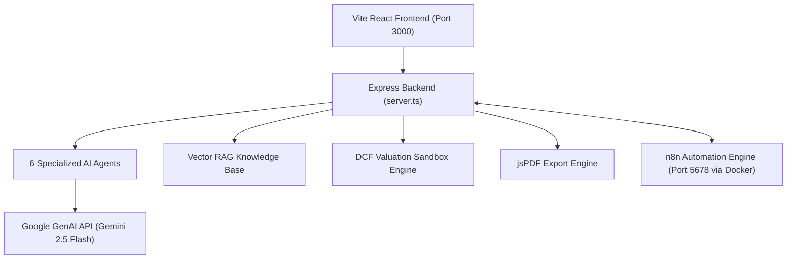

# Meridian Platform — Execution & Setup Guide (`run_guide.md`)

This guide explains how to configure, run, and develop the **Meridian Multi-Agent AI Investment Research Platform**, as well as how to run the self-hosted **n8n workflow automation environment** using Docker.

---

## 1. System Requirements & Prerequisites

- **Node.js**: v18.0.0 or higher (v20+ recommended)
- **npm** (or **bun** / **pnpm**)
- **Docker Desktop**: Running on Windows/macOS/Linux (required for n8n workflow engine)
- **Gemini API Key** *(Optional)*: If omitted or left as default, Meridian automatically runs in mock simulation mode with complete institutional financial datasets.

---

## 2. Environment Configuration

The repository uses a `.env` file for runtime configuration.

```bash
# Copy example if setting up fresh
cp .env.example .env
```

Edit your `.env` file:

```env
# Google Gemini API Key
# If left as "MY_GEMINI_API_KEY", Meridian uses rich deterministic fallback datasets
GEMINI_API_KEY="YOUR_ACTUAL_GEMINI_API_KEY_HERE"

# Base Application URL
APP_URL="http://localhost:3000"

# Optional: Gemini Model Selection (defaults to gemini-2.5-flash)
GEMINI_MODEL="gemini-2.5-flash"
```

---

## 3. Starting the Meridian Web Application

### Step 1: Install Dependencies
If you have not already installed dependencies:
```bash
npm install
```

### Step 2: Launch the Dev Server
The development server launches both the Express backend API and the Vite React frontend in a single integrated process:

```bash
npm run dev
```

- **Application URL**: [http://localhost:3000](http://localhost:3000)
- The server binds to `http://0.0.0.0:3000` and automatically proxies Vite hot-module replacement (HMR).

### Step 3: Available NPM Commands

| Command | Description |
| :--- | :--- |
| `npm run dev` | Starts the unified Express + Vite development server |
| `npm run build` | Compiles client assets (`vite build`) and bundles `server.ts` (`esbuild`) to `dist/` |
| `npm start` | Runs the compiled production server (`dist/server.cjs`) |
| `npm run lint` | Runs TypeScript type checking (`tsc --noEmit`) |
| `npm run n8n:up` | Starts the Dockerized n8n container in the background |
| `npm run n8n:down` | Stops the n8n Docker container |
| `npm run n8n:logs` | Streams live output logs from the n8n container |

---

## 4. Starting the n8n Workflow Automation Engine

Meridian includes a Docker Compose setup for n8n with persistent storage and pre-mounted workflow files.

### Step 1: Ensure Docker Desktop is Running
Make sure Docker Desktop is open and the Docker engine is running.

### Step 2: Start the n8n Container
Run either the npm shortcut or docker compose directly:

```bash
npm run n8n:up
# Or directly:
docker compose up -d
```

- **n8n Web UI**: [http://localhost:5678](http://localhost:5678)
- Persistent workflow data is stored in the Docker volume `meridian_n8n_data`.

### Step 3: Import Meridian Pre-Configured Workflows
Meridian includes 3 pre-built institutional workflows located in the `n8n/` folder:

1. `n8n/daily_data_refresh.json` — Scheduled weekday fundamentals & price sync
2. `n8n/earnings_news_watcher.json` — 15-minute polling of SEC filings + Vector RAG embedding
3. `n8n/weekly_portfolio_digest.json` — Sunday evening automated portfolio rebalancing & PDF digest

**To import into n8n:**
1. Open **[http://localhost:5678](http://localhost:5678)** in your browser.
2. Complete the one-time owner account setup if opening for the first time.
3. In the left navigation, click **Workflows** > **Add workflow** (or press `Ctrl + O`).
4. Click the top-right menu button (`⋮`) and select **Import from File**.
5. Select any of the `.json` files inside the `n8n/` folder in this repository.

> [!TIP]
> **Connecting n8n to Meridian inside Docker:**
> When configuring HTTP Request nodes in n8n to call Meridian endpoints, use `http://host.docker.internal:3000` instead of `localhost:3000`, because `localhost` inside a Docker container refers to the container itself.
>
> Examples:
> - `http://host.docker.internal:3000/api/n8n/daily-refresh`
> - `http://host.docker.internal:3000/api/rag/embed`
> - `http://host.docker.internal:3000/api/agents/news`

---

## 5. Application Architecture & Key Modules



### The 6 AI Agents (`/api/agents/orchestrate`)
1. **Financial Statement Analysis Agent**: Income statement, balance sheet, free cash flow analysis, and anomaly detection.
2. **News Research Agent**: Real-time sentiment scoring, headline analysis, and catalyst identification.
3. **Risk Analysis Agent**: Beta, volatility, downside drawdowns, and solvency stress-testing.
4. **Valuation Agent**: Multi-stage DCF, WACC calculations, terminal value, and peer multiples.
5. **Portfolio Advisor Agent**: Target sizing, sector drift limits, and Sharpe ratio optimization.
6. **Investment Report Agent**: Institutional-grade thesis synthesis and risk/reward summaries.

---

## 6. Troubleshooting & FAQ

### Q: Why do agents work even without a Gemini API Key?
Meridian features a resilient architecture with built-in structured financial fallbacks. If `GEMINI_API_KEY` is not provided or remains `"MY_GEMINI_API_KEY"`, the platform immediately returns rich institutional financial models and reports without stalling. To switch to live LLM generation, replace the key in `.env` and restart the dev server.

### Q: Docker says `docker-credential-desktop: executable file not found in %PATH%`
On Windows, this happens if Docker Desktop was recently installed or the active terminal session hasn't refreshed its `%PATH%`. 
- Ensure `C:\Program Files\Docker\Docker\resources\bin` is in your system `PATH`.
- Open a new PowerShell terminal or run:
  ```powershell
  $env:Path = "C:\Program Files\Docker\Docker\resources\bin;" + $env:Path
  ```

### Q: Port 3000 or 5678 is already in use
- To change the Meridian port, modify `const PORT = 3000;` in `server.ts`.
- To change the n8n port, update the `ports:` entry in `docker-compose.yml` (e.g. `"5679:5678"`).
